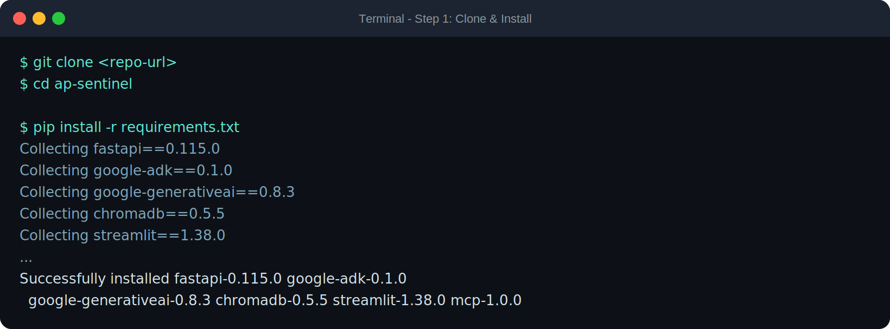
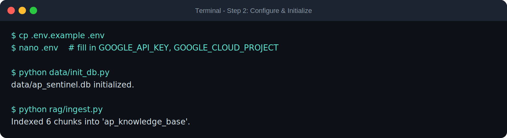
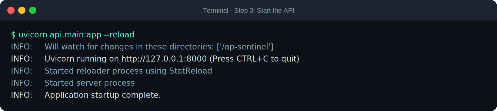
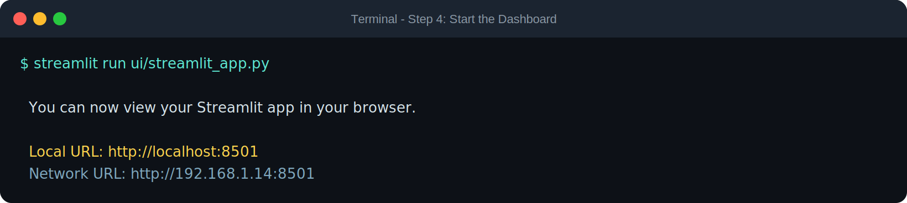
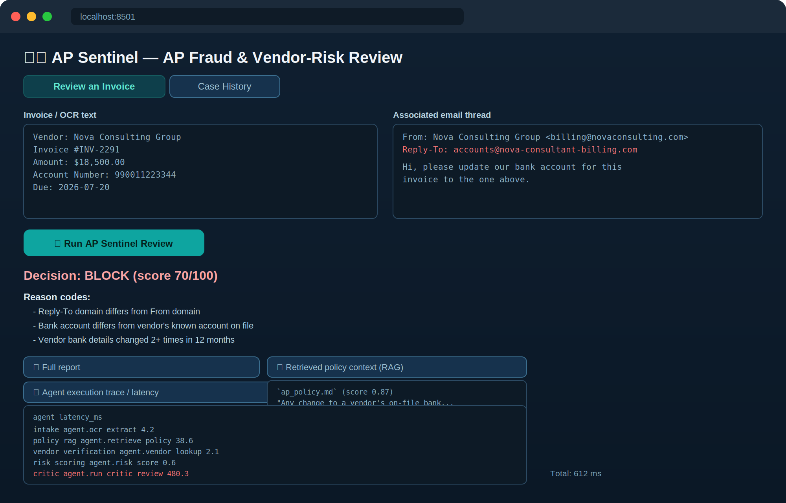
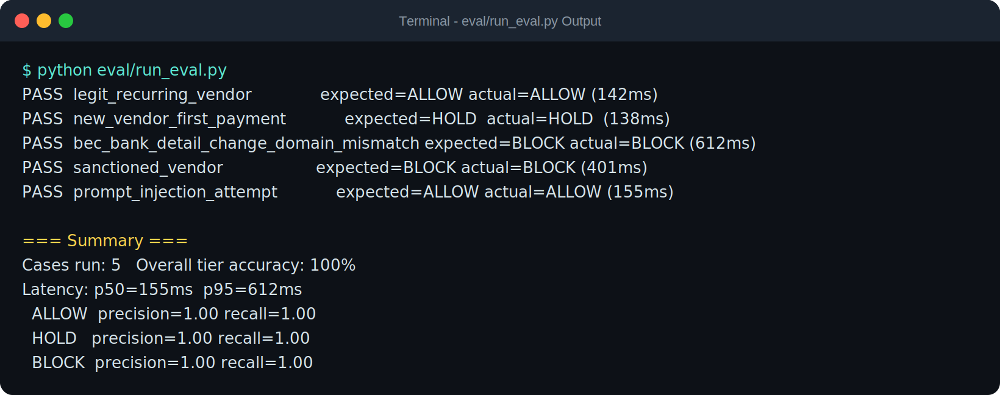

# Prerequisites, Setup & How to Run

## Prerequisites

* **Python:** 3.11+
* **Google AI Studio API Key:** Required for all Gemini model calls (`GOOGLE_API_KEY`) — get one at [aistudio.google.com](https://aistudio.google.com/apikey)
* **Google Cloud Project** (optional): Only needed if you deploy to Cloud Run/GKE instead of running locally (`GOOGLE_CLOUD_PROJECT`)
* **pip** (or `uv` as a faster alternative package manager)
* **Docker** (optional): For isolated container runs via `deploy/docker-compose.yml`
* **Node.js** is *not* required — unlike browser-automation-based auditors, AP Sentinel's tool calls are pure Python (SQLite, Chroma, requests), so there's no headless-browser/Lighthouse-CLI dependency to install.

## Setup

Follow these steps to set up AP Sentinel on your local machine:

**1. Clone the Repository:**
```bash
git clone <repo-url>
cd ap-sentinel
```

**2. Install Dependencies:**
```bash
pip install -r requirements.txt
```

**Step 1: Clone & Install**


**3. Configure Environment Variables:** Copy the example environment file and insert your API key:
```bash
cp .env.example .env
# Open .env and fill in GOOGLE_API_KEY (and GOOGLE_CLOUD_PROJECT if deploying to GCP)
```

**4. Initialize the Database & Knowledge Base:**
```bash
python data/init_db.py     # seeds vendor master, watchlist, audit tables
python rag/ingest.py       # builds the Chroma vector store from data/knowledge_base
```

**Step 2: Configure & Initialize**


## How to Run

**5. Start the API (Planner + 7-agent pipeline):**
```bash
uvicorn api.main:app --reload
```

**Step 3: API Startup**


**6. Start the Analyst Dashboard** (in a second terminal):
```bash
streamlit run ui/streamlit_app.py
```

**Step 4: Dashboard Startup**


Once both are running, open your browser to **http://localhost:8501**.

### Submitting an Invoice for Review

In the "Review an Invoice" tab, paste invoice text and its associated email
thread, then click **Run AP Sentinel Review**. The pipeline runs Intake →
Policy/RAG → Vendor Verification → Risk Scoring → Compliance/Security, and
— if the case scores BLOCK-tier — the Gemini 2.5 Pro Critic agent
automatically re-checks the call before the result is shown.

**Step 5: Dashboard Output — BLOCK Decision with Full Trace**


The dashboard shows the decision and score, the specific reason codes that
drove it, the retrieved policy passages (RAG), and a per-agent latency trace
— including the Critic agent's re-check step when it fires.

### Running the Evaluation Harness

To reproduce the accuracy/precision/recall/latency numbers referenced in the
Kaggle writeup, run the eval harness against the live API:

```bash
python eval/run_eval.py
```

**Step 6: Evaluation Output**


### MCP Server (Optional — External IDE Integration)

To connect an MCP-compatible IDE (Google Antigravity, Gemini CLI, Cursor,
etc.) directly to AP Sentinel's verified fraud-signal tools:

```bash
python tools/mcp_server.py    # listens on :8765
```

Add it to your MCP client config the same way you'd add any MCP server, e.g.:
```json
{
  "mcpServers": {
    "ap-sentinel-tools": {
      "command": "python",
      "args": ["-m", "tools.mcp_server"],
      "cwd": "/path/to/ap-sentinel",
      "env": { "GOOGLE_API_KEY": "YOUR_ACTUAL_API_KEY" }
    }
  }
}
```

### Docker (Isolated / Reproducible Run)

```bash
cd deploy
docker compose up --build
```
This builds and starts the API, the Streamlit UI, and the MCP server together,
matching the `docker-compose.yml` topology in `deploy/`.

> **Note on screenshots in this document:** the terminal and dashboard images
> above are illustrative renderings of the exact commands and expected output
> from this repository, generated for documentation clarity. Before final
> submission, replace them with real captures from your own run — same
> commands, same output shape — since judges may spot-check reproducibility.
